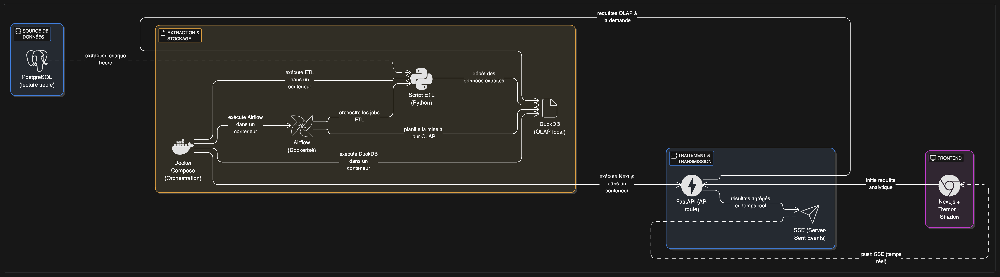

# airflow-duckdb-fastapi-starter

A ready-to-use, open-source ETL and analytics stack with Docker Compose, Airflow, DuckDB, FastAPI, and a simple frontend.  
**Extract from any PostgreSQL (read-only), transform with Python, analyze with DuckDB, and expose results via API or SSE.**



---

## ✨ Features

- **PostgreSQL (read-only)** as a data source (simulated or real)
- **Airflow** for ETL orchestration (Dockerized)
- **Python ETL script**: extract from Postgres, load into DuckDB (OLAP)
- **DuckDB**: local OLAP engine, blazing fast analytics
- **FastAPI**: exposes analytics results via REST API and Server-Sent Events (SSE)
- **Simple frontend**: HTML/JS to test API and SSE
- **All-in-one Docker Compose**: easy to run, easy to extend

---

## 🚀 Quickstart

### 1. Clone the repo

```bash
git clone https://github.com/yourusername/airflow-duckdb-fastapi-starter.git
cd airflow-duckdb-fastapi-starter
```

### 2. Start the stack

```bash
docker-compose up --build
```

- Airflow UI: [http://localhost:8080](http://localhost:8080) (user: `admin` / pass: `admin`)
- FastAPI: [http://localhost:8000/docs](http://localhost:8000/docs) (interactive API docs)

### 3. Simulate data (optional)

You can use the provided `populate.py` to inject random data into the source Postgres for demo purposes.

```bash
python populate.py
```

### 4. Test the ETL

- Trigger the DAG `etl_postgres_to_duckdb` in Airflow UI.
- Data will be extracted from Postgres and loaded into DuckDB.

### 5. Test the API & Frontend

- Open `frontend/index.html` in your browser.
- See metrics, average, and real-time updates via SSE.

---

## 🗂️ Project Structure

```
.
├── airflow/           # Airflow Docker build, DAGs, ETL scripts
├── fastapi_app/       # FastAPI app (API + SSE)
├── frontend/          # Simple HTML/JS frontend for testing
├── olap_data/         # Shared volume for DuckDB file
├── postgres/          # Postgres init scripts
├── diagram.png        # Architecture diagram
├── docker-compose.yml
├── README.md
└── ...
```

---

## 🛠️ Extending

- **Plug in your own ETL logic**: edit `airflow/etl/etl_postgres_to_duckdb.py`
- **Connect to a real Postgres**: update connection settings in `docker-compose.yml`
- **Add new API endpoints**: edit `fastapi_app/main.py`
- **Build your own frontend**: start from `frontend/index.html` or plug into your Next.js/React app

---

## 🧑‍💻 For development

- All services are dockerized for easy local dev.
- Volumes are mapped for live code reload (Airflow DAGs, FastAPI, DuckDB file).
- Airflow and FastAPI auto-reload on code changes.

---

## 📦 Requirements

- Docker & Docker Compose
- Python 3.10+ (for local scripts, not required for running the stack)

---

## 📄 License

MIT

---

## 🙏 Credits

- [DuckDB](https://duckdb.org/)
- [Apache Airflow](https://airflow.apache.org/)
- [FastAPI](https://fastapi.tiangolo.com/)
- [PostgreSQL](https://www.postgresql.org/)
- [Your Name or Company]

---

## 💡 Why this stack?

- **Modern**: DuckDB for OLAP, FastAPI for APIs, Airflow for orchestration
- **Simple**: One command to run, easy to extend
- **Reusable**: Use as a template for your own data projects

---

*Feel free to fork, adapt, and contribute!*
